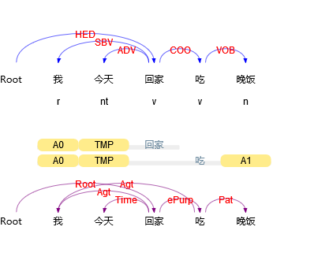
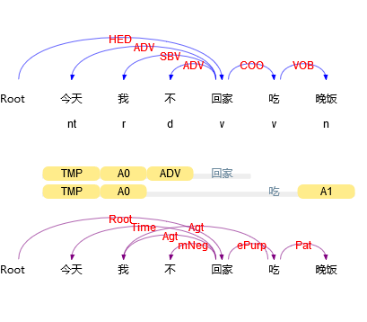

# Dep-Tree
tools for dependency grammar

## Usage

### parse tree in s-expression
```
python tree.py $FILE 
```

### simple tree distance
```
python tree_dist.py $FILE0 $FILE1
```

## Demo
```
# 我 今天 回家 吃 晚饭
(HED 回家
  (SBV 我)
  (ADV 今天)
  (COO 吃
      (VOB 晚饭)
  )
)

# 今天 我 不 回家 吃 晚饭
(HED 回家
  (SBV 我)
  (ADV 今天)
  (ADV 不)
  (COO 吃
      (VOB 晚饭)
  )
)

Tree dist=1.0
```

#### Demo From [HIT-LTP](http://ltp.ai/demo.html)





## Required Packages

[zss 1.2.0](https://github.com/timtadh/zhang-shasha)
